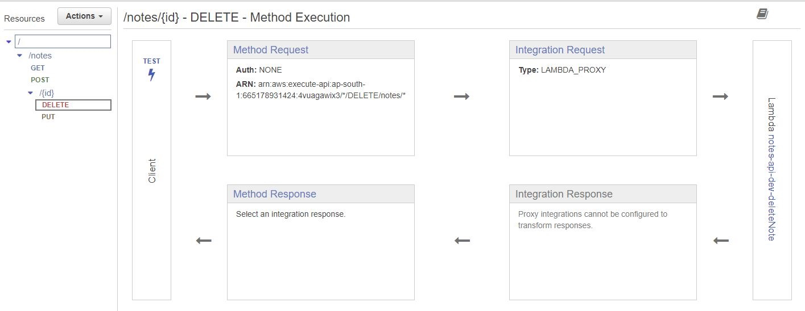
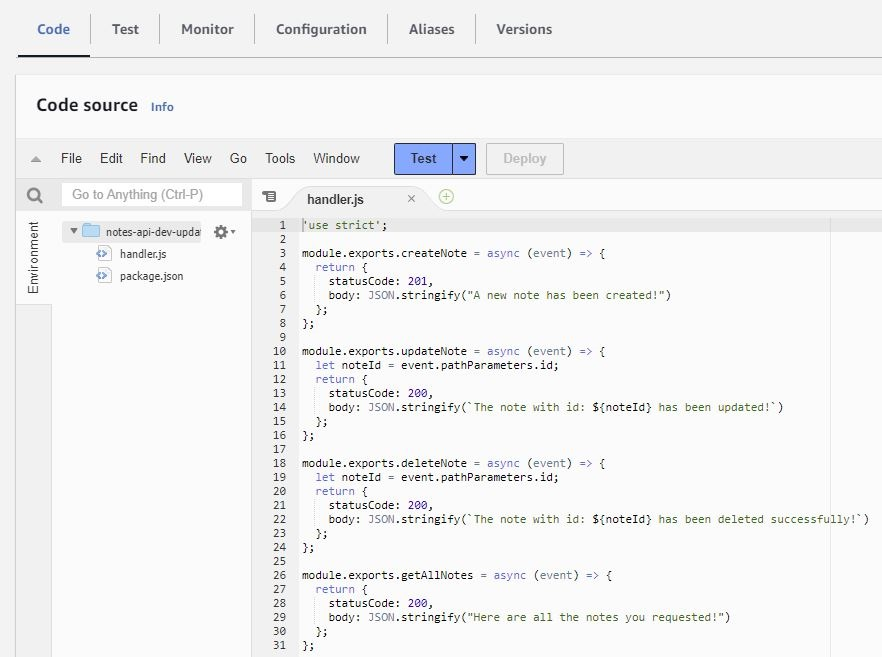
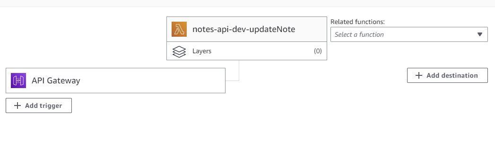

# Simple Notes App

We are going to create a simple note application that performs create, read, update and delete operation. We are going to use aws-serverless feature for this.

And for infrastructure as code, we are going to use `serverless` framework and `cloudformation`.

So lets install our node version `16.14.0` (which will be used to build this project).

```bash
nvm install 14.16.0
nvm use 14.16.0
node --version
npm install -g serverless@2
serverless --version
```

so our node version is:  `14.16.0` and serverless framework version: `2.72.3`

now lets create a user with `administrator access` (`admin group`) and create an acess key for `cli` activity.

Now from the official [serverless](https://www.serverless.com/) website, we go through the documenation to get the command for `AWS - Config Credentials` which will setup our default cli credential for aws.

```bash
serverless config credentials --provider aws --key <access_key> --secret <access_secret>
```

Now lets create a aws-nodejs serverless project from template,

```bash
serverless create -t aws-nodejs
```
we create a new `package.json` file for the packages that we will be using later on.

```bash
npm init -y
```

Now we modify to create our `createNote` lambda function that return a success code and a dummy response that a note has been created. 

After that, we modify our `serverless.yml` accordingly. We also use it to create the api-gateway (with  the method and the path) that invokes the lambda function (as an event/trigger)

Finally, we deploy our lambda function using the following command:

```bash
serverless deploy
```

now after `serverless` framework finishes, it shows the link to access our api-gateway and invoke the lambda.
we make a `post` reaction to the url and we get our dummy response that a note has been created.

Now similarly we user `serverless.yml` to create the other dummy endpoints and invoke the related dummy lambda function and it all seems to work now!

The things to be noted here are:

1. `path: notes/{id}` is how you define a dynamic path with a `pathParameter`.
2. `event.pathParameters.id` is how you access the path-parameter in your lambda function.


## How our console looks with the resources ? 

Okay, so now if we traverse our aws console to observe the resources that was created and managed for us:

1. We have a `Api-gateway` created for us with the name `dev-notes-api`. So serverless took the `stage` name and our `service`name and appended them with a `-` to name our api-gateway.

2. In the `s3 bucket` we also see a s3 bucket was created for storing the `.zip` file of our lambda function.

it was named : `notes-api-dev-serverlessdeploymentbucket-<somegibberishvalue>`

so first our `service` name and then our `stage` name and then the suffix `serverlessdeploymentbucket` and some gibberish value.

3. our lambda functions are named - `<service>-<stage>-<function_name>`

4. We see our path with the appropriate method were created and they invoke associated lambda function in a `proxy-integration` way.



Which means, our entire request is passed to our lambda function (api-gateway is doing no filtering and passing on the entire payload like a proxy). And the lambda response is similarly passed to the client as it was without any moderation by api-gateway.

5. Now although they invoke their own lambda function (createNote,deleteNote etc.) if we click on the lambda function (from the api-gateway UI), we taken to the same `handler.js` file where all the lambda function resides. 



So all the lambda function are created with in the same `.js` file, like in our local machine.

6. We also notice the graphical representation that the api-gateway is triggering this lambda function.



## Lets add dynamoDb table to our implementation

Now we add our dynamoDb table using `cloudformation` template inside serverless framework.
We can simply google `dynamodb cloudformation` to get the proper syntax.

In our template, we mention 

`BillingMode` (`PAY_PER_REQUEST`), `AttributeDefinitions` and `KeySchema` (the last 2 are required).
We could give it the table a name using `TableName` but we wanted to see what name our serverless framework gives to the table if we don't explicitly mention it.

And we find out the name is :  `<service>-<stage>-<LogicalNameOfTable>-<random_gibberish>`
(`notes-api-dev-notesTable-454H6S....`)

So for our sanity's sake, lets give it a simple name: `notesTable`

Now lets deploy again and we see our `notesTable` is created with one attribute which is the `hashkey` (partition key / primary id etc) and its `On-demand(PAY_PER_REQUEST)` modeled.
