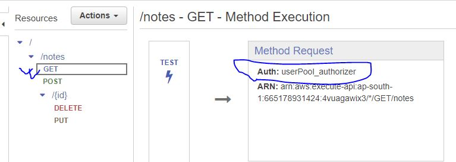

# Simple Notes App

We are going to create a simple note application that performs create, read, update and delete operation. We are going to use aws-serverless feature for this.

And for infrastructure as code, we are going to use `serverless` framework and `cloudformation`.

So lets install our node version `16.14.0` (which will be used to build this project).

```console
nvm install 14.16.0
nvm use 14.16.0
node --version
npm install -g serverless@2
serverless --version
```

so our node version is:  `14.16.0` and serverless framework version: `2.72.3`

now lets create a user with `administrator access` (`admin group`) and create an acess key for `cli` activity.

Now from the official [serverless](https://www.serverless.com/) website, we go through the documenation to get the command for `AWS - Config Credentials` which will setup our default cli credential for aws.

```console
serverless config credentials --provider aws --key <access_key> --secret <access_secret>
```

Now lets create a aws-nodejs serverless project from template,

```console
serverless create -t aws-nodejs
```
we create a new `package.json` file for the packages that we will be using later on.

```console
npm init -y
```

Now we modify to create our `createNote` lambda function that return a success code and a dummy response that a note has been created. 

After that, we modify our `serverless.yml` accordingly. We also use it to create the api-gateway (with  the method and the path) that invokes the lambda function (as an event/trigger)

Finally, we deploy our lambda function using the following command:

```console
serverless deploy
```

now after `serverless` framework finishes, it shows the link to access our api-gateway and invoke the lambda.
we make a `post` reaction to the url and we get our dummy response that a note has been created.

Now similarly we user `serverless.yml` to create the other dummy endpoints and invoke the related dummy lambda function and it all seems to work now!

The things to be noted here are:

1. `path: notes/{id}` is how you define a dynamic path with a `pathParameter`.
2. `event.pathParameters.id` is how you access the path-parameter in your lambda function.


## How our console looks with the resources ?
___

Okay, so now if we traverse our aws console to observe the resources that was created and managed for us:

1. We have a `Api-gateway` created for us with the name `dev-notes-api`. So serverless took the `stage` name and our `service`name and appended them with a `-` to name our api-gateway.

2. In the `s3 bucket` we also see a s3 bucket was created for storing the `.zip` file of our lambda function.

it was named : `notes-api-dev-serverlessdeploymentbucket-<somegibberishvalue>`

so first our `service` name and then our `stage` name and then the suffix `serverlessdeploymentbucket` and some gibberish value.

3. our lambda functions are named - `<service>-<stage>-<function_name>`

4. We see our path with the appropriate method were created and they invoke associated lambda function in a `proxy-integration` way.


Which means, our entire request is passed to our lambda function (api-gateway is doing no filtering and passing on the entire payload like a proxy). And the lambda response is similarly passed to the client as it was without any moderation by api-gateway.

5. Now although they invoke their own lambda function (createNote,deleteNote etc.) if we click on the lambda function (from the api-gateway UI), we taken to the same `handler.js` file where all the lambda function resides. 


So all the lambda function are created with in the same `.js` file, like in our local machine.

6. We also notice the graphical representation that the api-gateway is triggering this lambda function.


## Lets add dynamoDb table to our implementation
___

Now we add our dynamoDb table using `cloudformation` template inside serverless framework.
We can simply google `dynamodb cloudformation` to get the proper syntax.

In our template, we mention 

`BillingMode` (`PAY_PER_REQUEST`), `AttributeDefinitions` and `KeySchema` (the last 2 are required).
We could give it the table a name using `TableName` but we wanted to see what name our serverless framework gives to the table if we don't explicitly mention it.

And we find out the name is :  `<service>-<stage>-<LogicalNameOfTable>-<random_gibberish>`
(`notes-api-dev-notesTable-454H6S....`)

So for our sanity's sake, lets give it a simple name: `notesTable`

Now lets deploy again and we see our `notesTable` is created with one attribute which is the `hashkey` (partition key / primary id etc) and its `On-demand(PAY_PER_REQUEST)` modeled.


### lets use the dynamoDb table inside our lambda function
___

We are going to use the dynamoDb table inside our lambda function. And for that we are going to use the `aws-sdk`. For documentation, we just google `dynamodb javascript sdk`. 

Now in the documentation, we can see how to interact with dynamoDb using `aws-sdk` for javascript and instance that is used is `AWS.DynamoDB` but instead of that we are going to use the simpler one `AWS.DynamoDB.DocumentClient`


Now first, we install our aws-sdk (we are going to use the sdk version 2 for this)

```console
npm install aws-sdk@2
```


Then in our lambda file (above code for optimization purpose), we include the instances for communicating with the dynamodb table.

```js
const dynamoDb = require("aws-sdk/clients/dynamodb");
const documentClient = new dynamoDb.DocumentClient({region: 'ap-south-1'});
```


After that, we make the following changes for successful data entry.

1. we parse the event-body by `JSON.parse(event.body)` to get our post-data.
2. we add our context (`context`) and callback (`cb`) parameter too in our `async` lambda.
3. we add a try-catch block for using `await` with `promise`.
4. we `ConditionExpression: "attribute_not_exists(notesId)"` so that dynamodb first checks for the id that is to be created to make sure the item does not already exist.

Now we deploy our app using `sls deploy` (sls is short-form of serverless)

Now we post to our endpoint with the following json data:

```json
{
    "id": "11ab12",
    "title": "my first post",
    "body": "this is my post body"
}
```

but we receive an error.

```
User: arn:aws:sts: : 6517....:assumed-role/notes-api-dev-ap-south-1-lambdaRole/notes-api-dev-createNote is not authorized to perform: dynamodb:PutItem on resource: arn:aws:dynamodb:ap-south-1: 6651789...4:table/notesTable because no identity-based policy allows the dynamodb:PutItem action
```

So we facing a permission related error. We need to give our lambda function the permission to `putItem` in the dynamoDb table.

Now we can give IAM permission at the top level (so each of our lambda function get the same permission)

Lets add the `PutItem` permission now. We have to mention the resource Arn. For that, we can use the `intrinsic function` (`Fn::GetAtt`).

(google `dynamodb cloudformation` and go to `return value` section)


so our resource Arn section looks: `Resource: !GetAtt notesTable.Arn`

Now if we deploy our app again and make the post request, we see it works!

And if we check our dynamoDb table, the entry should be there. Now if we make the request a 2nd time with the same object, we should see `The conditional request failed` error as we had put the `ConditionExpression` in our code.

### using serverless-iam-roles-per-function plugin
___

Using iam roles at the top level which is applied for each lambda function is okay in some scenario but no in this one. We gave all our lambda function `put` permission to our dynamoDb table. But what about our delete lambda function? it need delete permission. But if we apply it in the top level then our create lambda function will get the delete permission too.

So we should give each function least amount of privilege(permission) to do the task it needs.

So to apply function level permission, we need a plugin called `serverless-iam-roles-per-function` and we are going to install it as a dev-dependency (wont be install during production/deployment)

```console
npm i --save-dev serverless-iam-roles-per-function
```

In the `package.json` file, it should be added as our dev-dependency.

```json
 "devDependencies": {
    "serverless-iam-roles-per-function": "^3.2.0"
  }
```

Now in our `serverless.yml` file, we add our plugin section and our `serverless-iam-roles-per-function` plugin.

```yml
plugins:
  - serverless-iam-roles-per-function 
```

now we can take the `iamRoleStatements` section from the top level and use it in the function level.

we have now added our `PutItem` permission at the `createNote` lambda function level.

lets deploy again to see if our post endpoint still works! and we see it does!


### Fix our updateNote lambda function
___

So far our updateNote lambda function just returns a dummy message that it has updated the table with the appropriate data.

So lets make actual update to the dynamoDb table. But first, we need to give our lambda function the `UpdateItem` permission.

Now we also do not want to hard code the dynamoDb table name, like we did in the `createNote` function. Instead we can make use of `Environment` variables. We use intrinsic function to get the created table name (`ref`, which returns the table name as we can see in the documentation or in the above posted screenshot) and then store it in an environment variable to be used inside our lambda function.

And we add and use the environment variable similarly inside the `createNote` function as well.

Now for `updateNote`, instead of return a single string as a JSON (using JSON.stringify()) we are sending back the entire updated item as a response when a valid update operation is done.

Now lets try to update the item by making a put request at the proper path(`.../11ab12`) with the following data:

```json
{
    "title": "my first post HAS BEEN UPDATED!",
    "body": "this is my post body (edited)"
}
```

Also we are now adding a method `send` for creating the return object.

Now finally, lets check if the conditional expression works! Try to update data for a non-existing data by requesting to path: (`..\11ab14`) and see the error `"The conditional request failed"`. So everything is working as we wished.


### Fixing deleteNote endpoint 
___

So now we want to make `deleteNote` endpoint functional and the steps for that are pretty much similar to the one we have done.

1. We add environment variable to our `deleteNote` function so we can get our table name with out hardcoding it.
2. We add `iamRoleStatements` so our table has the permission to delete items.
3. We use the `documentClient` to delete our item


### Fixing getAllNote Endpoint 
___

Now fixing the `getAllNotes` endpoint is probably the simplest of all. We need to scan the database for all notes. And For that,

1. We add environment variable for the table name
2. We add the `Scan` IAM permission for the table
3. We scan the table (only need the table name and nothing else) and return the result

(note: when scanning the database there is a limit to how much data that is scanned and fetched. If that limit is reached, dynamoDb sends an additional parameter that works as an offset which you can use as the start point for the next scan operation)

### Optimization
___

So now all our endpoint is functional but we will explore a few optimization tactics.

1. <u> `EmptyEventLoop` latency fix </u>

Since JavaScript uses `event loop` which uses `even queues` for managing asynchronous operations, whenever we are using `cb(200,send(...))` callback function to return the response, sometimes, NodeJS may not immediately call that callback function and return the response and instead, wait for the `event queue` to be empty (assuming there are some task in the `event queue`).

This scenario may add latency to our lambda function. So, to remedy this we set `context.callbackWaitsForEmptyEventLoop` to false.

2. <u> Keep http connection alive for reducing latency </u>

In all our lambda function, we communicate with the dynamoDb using the `dynamoDb.DocumentClient` to communicate with our dynamoDb table. But behind the scene it uses, http call to the table to perform its operation. 

But every time, we make a http call, a latency is added to our function during the `handshake` part of the http call in order to establish that connection.


Instead we can keep the http connection alive after using it (after some time it will shut down anyway) which allow aws to reuse the same connection sometimes(when it can) and reduce `handshake` latency.


We can either use the `environment variable` (`AWS_NODEJS_CONNECTION_REUSE_ENABLED`) to do this which is much simpler or we could use the code which would be a bit cumbersome.

(Note that: we will have to add this `environment variable` to every lambda function that uses that `dynamoDb.DocumentClient` from `aws-sdk`, which is all four of them)

3. <u> DynamoDB timeout problem fix </u>

When we are using lambda with API gateway, we need to know:


- API gateway sends a timeout response to the client after `29 second`
- So lambda though it can run up to `15 minutes` must be configured to run at most `< 29 seconds` to send a response when we are using it with api-gateway in a ***synchronous*** manner.


- But dynamoDb has latency in `milliseconds`. Yet, sometimes a very small percentage (`.000-something`) of query can take several minutes. By default our `dynamoDb.DocumentClient` is configured to retry up to `10 times` in such cases and take up to `50 seconds` to get a response from the dynamoDb table.

We should over ride this configuration to `3 times` maximum-retry and take `5 seconds` maximum to get a response. Otherwise, return a timeout.


For further reading, the article is pinned [here](https://seed.run/blog/how-to-fix-dynamodb-timeouts-in-serverless-application.html).

Also take a look at [this](https://docs.aws.amazon.com/sdk-for-javascript/v2/developer-guide/node-reusing-connections.html)

## Add Access Control
___

So to block complete public access there are some measure that we can take.

1. <u> <h3> Api Key </h3> </u>

We can use `Api Key` for adding some sort of limitation to public access. We go to our `Api gateway` service and open the gateway for our app (`dev-notes-api`)

After that, we go to `API Keys` section and create an API key. But we can not yet use it. In order to use, we first have to create a usage plan from the `Usage Plans` section and associate a `API Resource` and a deployed `Stage` for that resource. (in our usage plan, we can rate limit that would apply to our entire `API Resource` or we can apply rate limit to individual method of that `API resource` too)

Next, we need to connect this usage plan to the `Api Key` we created. Now we go to our `API resource` and choose any endpoint and turn `API Key Required` to true and deploy our `API resource` to the `stage` of the above created usage plan.

And that's it! Now that API endpoint of that stage can not be access without the API key. We have to send a request to that endpoint with a header `x-api-key` and the value of that api-key in order to access it. 

While accessing we can also check the limit we set in the usage plan. After the limit is exceeded we won't be able to access that resource.


Now **API key** can not be used as some sort of authorization as the limitation of it is pretty obvious. 
Below are reason to use it:


2. <u><h3> Lambda Authorizer </h3> </u>

Now we are going to add a lambda authorizer to our application. A lambda authorizer is like any other lambda function except this is called every time when an api end point (set up with this lambda authorizer) is hit and this lambda authorizer returns a `Principal & Policy` which determines whether the lambda function associated with that api endpoint should be invoked or not.


So lambda authorizer is 2 type:

1. Token type
2. Request type

By default, if we do not configure anything, the lambda authorizer will be of `token` type. In this case, we have to sent the `token` in the request header as the value of `Authorization` key.

Also note that, the returned policy of the lambda authorizer is cached by default for 5 minutes.

So now,

1. We add new file (module) `my-authorizer.js`  where we export our authorizer lambda function `authHandler`.

2. We modify the `serverless.yml` file and give this function a `logical name` (`nashir_lambda_authorizer`)

3. Next, for every lambda function, we created an api endpoint as the trigger/event. For each of this api-endpoint, we add an authorizer and simply mention our `logical name` of our lambda authorizer function (`nashir_lambda_authorizer`)

4. Now we need to modify our lambda authorizer function to return a `authResponse` containing the principalId and the policy. For now, we will simply use dummy string `allow` or `deny` to determine a valid token. In real life, case we would actual verify something like a `jwt` token.

Now the IAM policy that our lambda authorizer has to return a has a particular format. We can go to IAM service and look into any policy (`adminReadUserPolicy` in this case) and we will see the format.


That is it. If we now deploy again we should see from console (`Authorizer` section) that our lambda function is created.


We should also notice that each api end point now has a authorizer (our lambda authorizer)


5.  Now lets make a request to the `/notes` endpoint to see all the notes and we get a response that we are not authorized.

We add a header to our request with the key `Authorization` and the value `allow` and see that we are getting our responses successfully.

Now if we changed the header value to `deny` we should see the **'unauthorized'** response again.

But if we changed to value to anything other that `allow` or `deny` we see `message` object with `null` value. But in our code, we returned **"Error: Invalid token"** error which we should see in the CloudWatch logs for our lambda authorizer.


7. We should note that, we can also return a `context` object in our `authResponse` from the lambda authorizer. This context object can have many useful information that our `inner` lambda function can use (like more information about the user that are fetched from the database etc.).

And so, this context object is also available in our inner lambda function `event` object. Lets console log this in our `getAllNotes` lambda function and make a request to the `/notes` endpoint to see all the notes with `Authorization` header and `allow` value.

Now lets see our `getAllNotes` function's log in CloudWatch to see that the context object with the dummy key **'foo'**  and dummy value **'bar'** is there along with the `PrincipalId`


We also see that the policy that our lambda function returns is available in our inner function.


<u> Using Cognito User Pool as our Identity Management System</u>

As we have mentioned, in a real scenario a user would get some some `jwt` token from a ` Identity Management system` after entering their credential and then our lambda authorizer will get that token and verify it with the `Identity Management system` to determine where the user should be allowed to proceed or not.

For practice, we will use `Cognito User Pool` as our `Identity Management system`.


We go to `Amazon Cognito` and then click on `Create User Pool` to create a new user pool for our testing.

We keep most options default except for the following changes:

1. We choose `User name` as `our Cognito user pool sign-in options` and tick both options for `user name requirements`


2. We choose `No MFA`.
3. We make our `Given Name` required.


4. We don't add any **Custom attributes** which is optional anyway.

5. For sending email to the user, we use the default `Simple Email Service` (SES) option and setup our sender email address in `FROM email address` dropdown verifying it with `Simple Email Service` (SES).

6. We give our user pool a name **"MyNotesUserPoolTest"**

7. From the `Hosted authentication pages` section, we select `Use the Cognito Hosted UI` for simplicity (Cognito will provide us a UI for login and sign up)

8. We use the default Domain type `Use a Cognito domain` and our prefix is `https://myno****` which needs to be unique in our region (`ap-south-1`)

There are fixed set of formats that are required while we are using this domain. The pattern that will be using:
```console
https://<your_domain>/login
?response_type=token
&client_id=<your_app_client_id>
&redirect_uri=<your_callback_url>
```
From [this](https://docs.aws.amazon.com/cognito/latest/developerguide/cognito-user-pools-app-integration.html) website, you can see more details.

9. The URL we are going to use is: `http://localhost:3000`, which although does not exist will help us to retrieve the token value, as we are planning to use the `Implicit Grant` flow for authentication where the token is appended in the callback URL's query parameter.

In the `Advanced app client settings` settings section, we see that `OAuth 2.0 grant types` is set to be `Authorization code grant` by default. We change it to `Implicit Grant`.


Now lets enter our user pool.

Now lets create a user for this user pool and test our sign-in by the following step:

1. In the `Users` section, click on **Create User** to create a new user from the admin panel of cognitio with a temporary password. We also mark the email as verified for simplicity.

2. From the `App integration` section, we copy the domain for the hosted UI of the congnito and paste it in a tab to log in our created user.

3. But pasting it directly does not do anything since we have pass some parameter as query string for our `Implicit Grant` flow to work.

The parameters are:

- response_type=token
- client_id=<your_app_client_id>
- redirect_uri=<your_callback_url>

We can get our `client_id` from the `App integration` section and our `redirect_uri` will be `http://localhost:3000` 

(note that: you can not put any other URL as the `redirect_uri` as that is the URL we registered during our cognito user pool setup. If you do, you will see this error : *An error was encountered with the requested page.*)

4. We pass those parameter and we see a sign-in page given to us by cognito.

Now when we login using the correct credential (our username and password), we are prompted to create a new password and enter our `Given Name` as we had configured this as a required attribute (we can enter any name we like).

Now after successfully entering the information we are redirected to **http://localhost:3000** with the following parameters in the URL

- id_token
- access_token
- expires_in
- token_type


We see that the `token_type` is **Bearer** and `expires_in` is **3600** seconds which is 1 hour.
The `id_token` is long string which is nothing but a `jwt` token.

So we paste the `jwt` token in the [jwt.io](https://jwt.io/) website and see what information is available in the token.

- From the header, we see `"alg": "RS256"` which means `RS256` algorithm is used to sign the token.

- From the payload, we see that:
```json
{
  "at_hash": "wuOYKA1L4T4HHuM5q9H***",
  "sub": "c388a69******4b68432d5",
  "email_verified": true,
  "iss": "https://cognito-idp.ap-south-1.amazonaws.com/ap-south-1_UF0U******",
  "cognito:username": "nashir",
  "aud": "585124vhn0hi45p0qf6l****",
  "event_id": "a2e46994-7901-43bf-af8b-e0a********",
  "token_use": "id",
  "auth_time": 1682869974,
  "exp": 1682873574,
  "iat": 1682869974,
  "jti": "92976743-2871-43fd-8bd5-4a294****",
  "email": "an***.13@gmail.com"
}
```
Among bunch of information, we see that our user's `email` and `cognito:username` is included. Our user's unique id `sub` is also there. The `auth_time`,`exp`, `iat` tracks the authentication and expiration time etc.

<u>Validate our Cognito provided JWT token in the lambda authorizer</u>

Now we are going to modify our lambda authorizer so that, now we can verify the `jwt` token we received from cognito instead of the dummy `allow` or `deny` string in the header.

There are many library that can help us with the `jwt` verification but we are gonna use `CognitoJwtVerifier` from `aws-jwt-verify` package since this is much simpler while working with aws cognito.

1. First we comment out our dummy `allow` or `deny` verification code.
2. Then we install the package by:
```console
npm i aws-jwt-verify
```
3. Then, we configure the `CognitoJwtVerifier` object with the proper settings.

```javascript
const jwtVerifier = CognitoJwtVerifier.create({
  userPoolId: "<USER_POOL_ID>",
  tokenUse: "id",
  clientId: "<CLIENT_ID>"
  })
```
We can find our `USER_POOL_ID` at the top of our cognito user pool and our `CLIENT_ID` from the `app integration` section. Here, `tokenUse` will be **"id"** since this is an `id token`, not an `access token`.

4. Then we verify the token in a try catch block and if no exception is thrown then we send back our policy with `allow` effect like before otherwise, just like before, we return an error.

We also do `console.log(JSON.stringify(payload))`, to see the payload after verifying.

So now the `aws-jwt-verify` library does the following thing:

- Check if the token is created by the configured user pool
- Check if the token is expired or not
- Also let us know of the `user group` the current user belongs to(we can add congnito users to a group if we like) which we do not need in this case.

We also change the `runtime` in the `serverless.yml` file from `nodejs12.x` to `nodejs14.x` since `nodejs12.x` causes some error while working with the `aws-jwt-verify` library.

Now we just deploy our app again with `sls deploy`.

We check in our postman with `/notes` endpoint and see that our endpoint is returning a `message` response with `null` value even when we are attaching `Authorization` header with the value `allow`.

Now instead, we set the `Authorization` header value to the `jwt` token we received above we see the response successfully. 

Now we if we visit, `CloudWatch`, in our lambda authorizer logs, we see that the payload contains the same data we had extracted using **jwt.io** above.


3. <u> <h3> Cognito User Pool <i>authorizer</i> </h3> </u>

Now aws support another type of authorizer other than lambda authorizer and that is `Cognito Authorizer`. 

From console, if we just go to our `dev-notes-api` api-gateway and go to `Authorizer` section and choose to `create new authorizer`, we see the `Cognito pool` option.


We just have to mention our `Cognito User Pool` name here and that's it. This is much simpler if we just want to check whether a user exists in a `Cognito User Pool` and then authorize them to an endpoint.

So far all our endpoint uses `Lambda Authorizer`. But lets make some changes in our `serverless.yml` file, so that the `/notes` endpoint uses `Cognito Authorizer`.

First we give this `Cognito Authorizer` a name, `userPool_authorizer` and then we just mention the **arn** of the resource. Since the user pool is already created we do not need anything else.

We can find the `arn` of our user pool from the top section. 

Now after deploying again, we should see new  `Cognito Authorizer` in our console named `userPool_authorizer`.


Now the **Token Source** is same as lambda authorizer. We have to pass the token in header with the key `Authorization` and we test it with postman and find out that it works.

We can go to the console and verify that we are indeed using the congito authorizer for the `/notes` get endpoint.



Now if we check our `getAllNotes` lambda function's logs from `CloudWatch` we will see that inside the `event` object, the cognito authorizer has sent us all the `jwt` tokens payload information as claims.


 ***WARNING:*** About User Pool Authorizer

One important thing to note about `Cognito User Pool Authorizer` is that it only checks whether the user is in the user pool or not. Nothing else.

Lets assume the following scenario:

1. We create a user pool group and attach a IAM policy to it that denies all permission to perform any action on our `dev-notes-api` api-gateway resource (policy is named `noAccess`).

2. Now lets add our already created user to this group.

3. Now lets try to access the `/notes` get endpoint with the authorization token. We will see that are still able to access our resource.

4. But if we investigate the `getAllNotes` lambda function's logs to check the payload we received in the `jwt` token (which should be passed to the inner function in the  `event` object), we see that the group and the inherited IAM role is there but our `cognito user pool authorizer` is still allowing us to access the api-gateway.


So, what should we do in case we want to block such user with `noAccess` permission ?

We could use our custom lambda authorizer and handle it inside there by checking the IAM role and user group or we could also use the IAM authorizer.


 ***CLoudFormation:*** Lets add cognito user pool authorizer using CloudFormation template inside serverless framework

So for best practices, we will now use serverless framework and CloudFormation template to do all the things above instead of using aws console to do our work.

But first we do some refactoring. We move our CloudFormation template for our resources in a separate `resources.yml` file and then refer it inside our `serverless.yml` file, using `${file(resources.yml)}`

We can google `cognito cloudformation` for getting the reference guide [here](https://docs.aws.amazon.com/AWSCloudFormation/latest/UserGuide/aws-resource-cognito-userpool.html).

From the template, we first add `yml` for creating the **user pool**
After that, we need to create the **user pool web client**. Note that, we can create multiple client for the same user pool such as a client for mobile and anther client for web.

From the documentation-template, we also configure our **user pool domain**. We are going to use congnito provided domain, so we only have to state the prefix of it. We name it `my-notes-test-cog-dom` (Domain names can only contain lower-case letters, numbers, and hyphens.).

Both **user pool web client** and **user pool domain** requires the **user pool**'s id which we get using the `!Ref myCognitoUserPool` intrinsic function.

Since we do not use custom domain, that is all we need and does not need to provide the configuration which would have been required for the custom domain.

Now we deploy our code and see whether our **user pool** is created with our **user pool web client** and **user pool domain**.

In our aws-console, we we visit the `Cognito` service, we see our `MyNotesUP` user pool is created in the `ap-south-1` region. Now inside this user pool, under `app integration` section, we see our cognito domain and our client is also created. So, everything is working.

Now lets also remove some of the hardcoded values in our app:

1. <u>Remove UserPool Authorizer's HardCoded Arn</u>

So for our `/notes` get endpoint, we are using the cognito user pool authorizer but we are hardcoding the already created user pool's arn here. 

Lets instead use the intrinsic function to do that: `!GetAtt myCognitoUserPool.Arn`

But now we also have to specify that this authorizer is a `Cognito UserPool Authorizer`, not a lambda authorizer. 
We do it by adding a type: `type: COGNITO_USER_POOLS`

2. <u> Remove Hard Coded value from CognitoJwtVerifier Configuration </u>

In our `my-authorizer` file, we configured `CognitoJwtVerifier` object with `userPoolId` and `clientId`. We hardcoded the values there. 

Lets instead use a environment variable. Since this is only required for the lambda authorizer `nashir_lambda_authorizer` we can just add those environment variable at that lambda function's level.

After that, we remove the hardcoding of those 2 values and instead retrieve the values from the environment using `process.env.COGNITO_USERPOOL_ID`.

***NOTE THAT*** <u><i> If we need environment variable which holds value for all our lambda functions in the `serverless.yml` file, then we should specify those environment variable at the `provider` level. Anything specified at the provider level is available for all the lambda function.</i></u> 

Lets deploy this stack again to see if everything is working properly and it is!

 ***Aws System Manager:*** Lets use aws system manger for practice

We can use the parameter store from aws system manager to save and retrieve some secret token.

Lets use it store our `arn` of the `cognito user pool` and then retrieve it in our `serverless.yml` file. We do not need to do it but let's try to do this way so we can have some practice regarding SSM parameter store.

While creating parameter store we should remember:

- The value of the key can be a string, string list or a secured string (a string that is stored after an encryption)

- While creating a parameter store, it is recommended to create the key-name as a path

We can read about the CloudFormation for `AWS SSM Parameter Store` from
[here](https://docs.aws.amazon.com/AWSCloudFormation/latest/UserGuide/aws-resource-ssm-parameter.html)

Now lets deploy this and see if the parameters are properly created and we see that it is.

Next, lets use this `arn` value in our `/notes` get endpoint's authorizer so it can be guarded by that cognito user pool authorizer.

We do it by this: `arn: ${ssm:/notes/dev/userPoolArn}` 

***NOTE THAT:*** <u> <i> When we are accessing the parameter in this format: `${ssm:/notes/dev/userPoolArn}`, we are expecting that the parameter is already available for us to use. We can not create and use this parameter in the same deployment. So now if I change the parameter key-name and redeploy we will face an error for this reason. </i> </u>